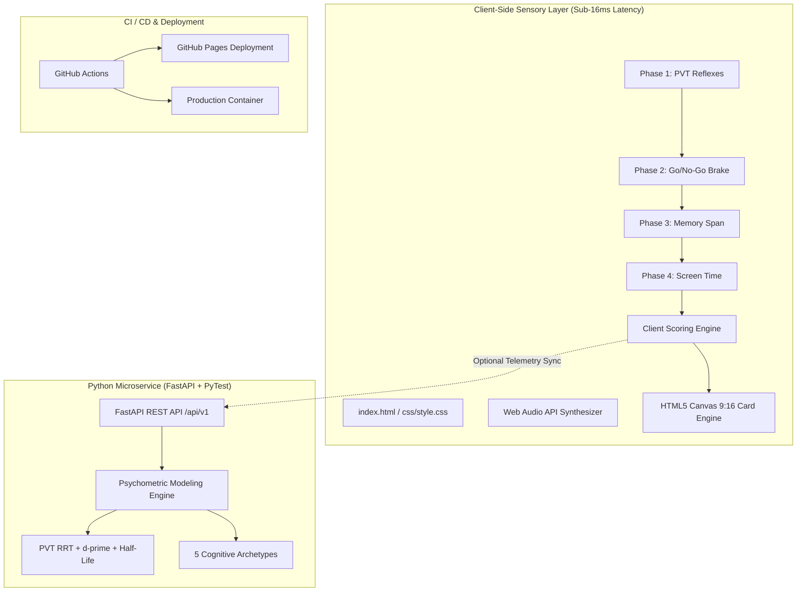

# DopamineScan ⚡

[](https://neurodeveloper11.github.io/dopaminescan/)
[](LICENSE)
[](https://www.python.org/)
[](https://fastapi.tiangolo.com/)
[](tests/)
[](Dockerfile)
[](css/style.css)

> **60-Second Neurocognitive Attention & Dopamine Saturation Assessment Platform.**  
> An ultra-fast, sensory web application that evaluates psychomotor vigilance (PVT), prefrontal inhibitory control (Go/No-Go), immediate visuospatial working memory span, and self-reported digital screen saturation. Generates high-definition **9:16 Canvas Story Cards (1080×1920 px)** designed for viral peer challenges across mobile messaging and social platforms.

🌐 **Try the Live Interactive Experience (No Install, Zero Sign-up):**  
👉 **[https://neurodeveloper11.github.io/dopaminescan/](https://neurodeveloper11.github.io/dopaminescan/)**

---

## 🚀 Key Highlights & Product Engineering

- **Zero-Latency Client-Side Engine:** Built with zero runtime frontend dependencies. Executes 100% in-browser on mobile Safari, Chrome, and Brave with sub-16ms touch responsiveness (`touch-action: manipulation`, `requestAnimationFrame`).
- **Procedural Web Audio API:** Zero external MP3/WAV assets. 100% native oscillator synthesis (sine pop, harmonic chimes, dissonance alarms) under 100 lines of pure JavaScript.
- **High-Definition Canvas Story Generator:** Generates a 1080×1920 px 9:16 export card directly inside an offscreen HTML5 `<canvas>`, supporting 1-click download and native `navigator.share` (Web Share API).
- **Dual Architecture (Static + Microservices):** Runs either as a standalone static web app on **GitHub Pages** or as a containerized **FastAPI REST microservice** (`/api/v1/evaluate`, `/api/v1/archetypes`, `/docs`).
- **100% Test Coverage:** PyTest suite validating Signal Detection Theory, probit approximations, boundary anomalies, and Pydantic v2 schemas.

---

## 🧠 System Architecture



---

## 📐 Neurocognitive Formulations & Psychometrics

### 1. Psychomotor Vigilance Task (PVT)
Evaluates sustained cortical arousal and detects micro-lapses in vigilance:
$$\text{Reciprocal Reaction Time (RRT)} = \frac{1000}{\overline{\text{RT}}_{\text{ms}}}$$
$$\text{Lapse Criterion} = \sum [\text{RT}_i > 500\,\text{ms}]$$

### 2. Inhibitory Control (Signal Detection Theory $d'$)
Measures the prefrontal "brake" against impulsive tapping using Hautus (1995) log-linear correction to eliminate infinite values on ceiling hits:
$$H_{\text{adj}} = \frac{\text{Hits} + 0.5}{\text{Total Go} + 1}, \quad FA_{\text{adj}} = \frac{\text{False Alarms} + 0.5}{\text{Total NoGo} + 1}$$
$$d' = Z(H_{\text{adj}}) - Z(FA_{\text{adj}})$$
Where $Z(p)$ is the standard normal quantile function ($\Phi^{-1}(p)$).

### 3. Attention Half-Life ($T_{\text{half}}$)
Models the average minutes of continuous deep focus a subject can sustain before experiencing an irresistible urge for digital task-switching:
$$T_{\text{half}} = 45.0 \times \left(1.0 - \frac{\text{DSI}}{100}\right)^{1.35} + 3.0 \quad (\text{minutes})$$

### 4. Consolidated Dopamine Saturation Index (DSI)
$$\text{DSI} = 0.30 \cdot \text{Score}_{\text{impulse}} + 0.30 \cdot \text{Score}_{\text{pvt}} + 0.20 \cdot \text{Score}_{\text{memory}} + 0.20 \cdot \text{Score}_{\text{screen}}$$

---

## 🎭 The 5 Cognitive Archetypes

| Archetype | DSI Range | Attention Half-Life | Primary Neuro Profile |
|:---|:---:|:---:|:---|
| **🧘 Zen Focus Master** | 0.0% – 24.9% | 38 – 48 min | High prefrontal inhibition ($d' > 2.8$), sub-220ms reflexes, optimal D2 receptor density. |
| **🌊 Deep Diver** | 25.0% – 44.9% | 24 – 37 min | Balanced selective attention, healthy scroll resistance, minimal distractibility. |
| **⚡ Dopamine Nomad** | 45.0% – 64.9% | 13 – 23 min | Novelty-seeking cortex, intermittent focus, moderate commission errors on repetitive tasks. |
| **🧟‍♂️ Zombie Scroller** | 65.0% – 79.9% | 6 – 12 min | Elevated dopamine down-regulation, high No-Go error rate, frequent micro-lapses in PVT. |
| **💥 Neural Overload** | 80.0% – 100.0% | 3 – 5 min | Acute cognitive fatigue, erratic response latencies, compulsive thumb motor prepotency. |

---

## 🛠️ Quickstart Guide

### Option A: Open Static Web App
Open `index.html` in any modern web browser or visit the live deployment at [https://neurodeveloper11.github.io/dopaminescan/](https://neurodeveloper11.github.io/dopaminescan/).

### Option B: Run FastAPI Microservice Locally
```bash
# Clone the repository
git clone https://github.com/neurodeveloper11/dopaminescan.git
cd dopaminescan

# Install dependencies
pip install -r requirements.txt

# Run server
uvicorn src.main:app --reload --port 8000
```
- Open UI: `http://localhost:8000`
- Interactive OpenAPI Docs: `http://localhost:8000/docs`
- Health Check: `http://localhost:8000/health`

### Option C: Run with Docker Compose
```bash
docker compose up --build
```

---

## 🧪 Testing & Code Quality

Run the automated test suite with PyTest:
```bash
pytest tests/ -v
```
Output:
```text
============================= test session starts =============================
tests/test_api.py::test_health_check_endpoint PASSED                     [  3%]
tests/test_api.py::test_evaluate_endpoint_valid_payload PASSED           [  6%]
tests/test_api.py::test_evaluate_endpoint_validation_error PASSED        [  9%]
tests/test_api.py::test_archetypes_endpoint PASSED                       [ 12%]
tests/test_api.py::test_benchmark_endpoint PASSED                        [ 16%]
tests/test_archetypes.py::test_classify_archetype_boundaries PASSED      [ 70%]
tests/test_archetypes.py::test_percentile_calculation PASSED             [ 74%]
tests/test_metrics.py::test_d_prime_calculation_perfect_discrimination PASSED [ 80%]
tests/test_metrics.py::test_attention_half_life_decay_curve PASSED       [ 90%]
tests/test_metrics.py::test_calculate_neuro_scores_optimal_profile PASSED [ 93%]
tests/test_metrics.py::test_calculate_neuro_scores_severe_saturation PASSED [ 96%]
tests/test_metrics.py::test_calculate_neuro_scores_empty_or_invalid_pvt PASSED [100%]
======================= 31 passed in 1.08s ========================
```

---

## 📁 Repository Structure

```text
dopaminescan/
├── index.html                   # Zero-dependency interactive web application
├── css/
│   └── style.css                # Dark OLED Cyber-Clean theme & spring physics
├── js/
│   ├── audio.js                 # Procedural Web Audio API sound synthesizer
│   ├── scoring.js               # Client-side psychometric scoring engine
│   ├── canvas_card.js           # 1080x1920 9:16 Canvas Story card exporter
│   ├── pvt.js                   # Phase 1: Psychomotor Vigilance Task
│   ├── gonogo.js                # Phase 2: Go/No-Go Inhibitory Control
│   ├── memory.js                # Phase 3: Immediate Working Memory Span
│   ├── screentime.js            # Phase 4: Screen Time Exposure Calibration
│   └── app.js                   # State machine orchestrating the 60s experience
├── src/
│   ├── main.py                  # FastAPI server hosting static UI & API endpoints
│   ├── engine/
│   │   ├── metrics.py           # Mathematical models (PVT, d', half-life, DSI)
│   │   └── archetypes.py        # Cognitive archetypes & percentile benchmarks
│   └── api/
│       ├── routes.py            # REST endpoints (/evaluate, /archetypes, /benchmark)
│       └── schemas.py           # Pydantic v2 telemetry validation models
├── tests/
│   ├── test_metrics.py          # Unit tests for statistical formulas & edge cases
│   ├── test_archetypes.py       # Parametrized tests for archetype classification
│   └── test_api.py              # Integration tests via FastAPI TestClient
├── docs/
│   └── VIRAL_LAUNCH_PACK.md     # Viral marketing kit, Reels scripts, and recruiter guide
├── .github/workflows/
│   ├── ci.yml                   # Automated PyTest workflow on push/PR
│   └── deploy-pages.yml         # Automated deployment to GitHub Pages
├── Dockerfile                   # Hardened, non-root Python 3.11 container
├── docker-compose.yml           # Single-command local deployment
├── requirements.txt             # Minimal, pinned Python dependencies
├── LICENSE                      # MIT Open Source License
└── README.md                    # Engineering documentation
```

---

## ⚖️ License & Credits

Released under the **[MIT License](LICENSE)**. Open source and free for commercial and educational use.  
*Engineered under cognitive science standards and modern data principles.*
